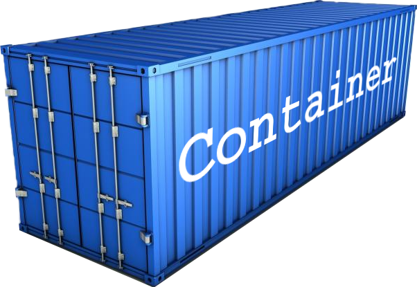

```{r setup, include=FALSE}
knitr::opts_chunk$set(echo = TRUE)
library(container)
```


### What's new?

Version 1.1.0 mainly adds new extract and replace operations.
Like base R lists, it now also supports negative complements (`x[-1]`) and logical
indexing (`x[c(TRUE, FALSE)]`). In addition, it enables range selection using
non-standard evaluation (`x[a:b]`, `x[1:c]`).
For a detailed overview of all changes in this release, see the
[changelog](https://rpahl.github.io/container/news/#container-110).


<aside>
```{r out.width = '100%', echo = FALSE}

```
</aside>

### Extraction

Negative complements and logical indexing now work as known from base R lists.

#### Negative complements

```{r}
co <- container(a = 1, b = 2, c = 3, d = 4)

co[-1]
co[-(1:3)]
co[-c("a", "d")]
```

#### Logical indexing

```{r}
mask <- c(TRUE, FALSE)
co[mask]

mask2 <- c(TRUE, NA)
co[mask2]       # NA treated as FALSE (warning) -> [a = 1, c = 3]
```

#### Range selection using non-standard evaluation (NSE)

Range selection using NSE works with names and numbers, including
mixed usage, reversed order, and negative complements.

```{r}
co[a:b]
co[1:c]
co[d:2]
co[-(b:c)]
```

**Warning**: while NSE selections are perfect for interactive work where clarity beats
ceremony, for serious code, explicit indices are preferred.

### Replacement

Replacing values works similarly to extraction.

```{r}
co <- container(a = 1, b = 2, c = 3, d = 4)

co[-(b:c)] <- 0
co
co[c(TRUE, FALSE)] <- 9
co
```


### Derived classes

As the `container` serves as the base class for all other classes in the
package, all new extraction and replacement operations are also available
for `deque`, `set`, and `dict` objects.

```{r}
s <- setnew(a = 1, b = 2, c = 3, d = 4)
s[-(b:c)]

params <- dict(a = 1, x = 3, b = "foo", y = "bar")
params      # dicts are always sorted by key
params[a:x]
```


To see the full official documentation, visit
[https://rpahl.github.io/container/](https://rpahl.github.io/container/index.html).
