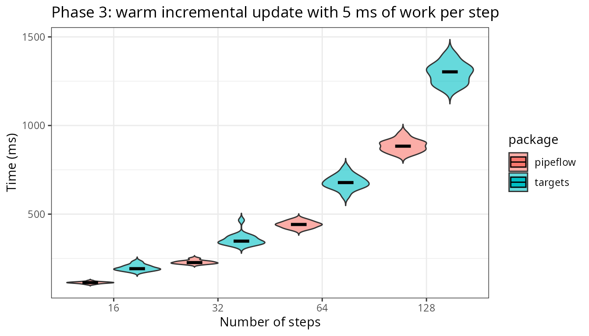

```{r setup, include=FALSE}
knitr::opts_chunk$set(echo = TRUE)
library(pipeflow)
```


### Pipeline setup

{pipeflow} builds a pipeline by adding one R function per step with
*pip_add* (see also the
[Get started](https://rpahl.github.io/pipeflow/articles/v01-get-started.html)
article). In this post, we'll work with the following toy pipeline:

 - step `load` produces a sequence
 - step `clean` doubles it
 - step `fit` sums it, and
 - step `report` formats the result

```{r pipeline-setup}
pip <- pip_new("my-pip") |>
    pip_add(
        step = "load",
        fun = \(n = 5) seq_len(n),
        tags = c("io", "daily")
    ) |>
    pip_add(
        step = "clean",
        fun = \(x = ~load) x * 2,
        tags = c("io", "core")
    ) |>
    pip_add(
        step = "fit",
        fun = \(x = ~clean) sum(x),
        tags = c("model", "core")
    ) |>
    pip_add(
        step = "report",
        fun = \(x = ~fit) paste("result:", x),
        tags = "report"
    )
```

<aside>
```{r out.width = '100%', echo = FALSE}

```
</aside>

Each step must have a unique name, and function parameters can refer to other
steps — for example, `x = ~load` takes the output of the *load* step.
We also assign `tags` to each step, which we will use to filter steps later.

Before we run it, let's have a look:

```{r pipeline-steps}
pip
```

We see one row per step, showing its parameters (`params`), the steps it
depends on (`depends`), its current `state` (all `new` before the first run),
and our `tags`. Once we run the pipeline, ...

```{r pipeline-run}
pip_run(pip)

pip
```

... there is a new `out` column with the results, which can also be
accessed directly:

```{r pipeline-print}
pip[["report", "out"]]
```


### Pipeline views in action

Real pipelines get long, and often you only care about a subset of steps: a
topic, a stage, or the steps that produce the desired outputs. Views
(new in v0.4.0) let you work on such a subset without copying anything.
They reference the underlying pipeline, so every operation applied to it
— running it, updating parameters, collecting output, … — writes through to
the original pipeline, restricted to the steps the view covers.

#### Creating views

`pip_view()` returns a view containing only the steps that match the given
filters:

```{r views-create}
pip_view(pip, tags = "core")
pip_view(pip, tags = "core", state = "done")
pip_view(pip, step = c("clean", "fit"))
```

By default steps must match *all* filters (logical AND), while the values
within one filter are alternatives (OR). `join = "union"` keeps steps that
match any filter, and `fixed = FALSE` treats filter values as regular
expressions:

```{r views-create-2}
pip_view(pip, tags = "report", step = "clean", join = "union")
pip_view(pip, step = "^f", fixed = FALSE)
```

#### Selecting steps with `[`

The extract operator (also new in v0.4.0) provides a data.table-like way of
selecting steps and returns a view by default:

```{r views-select}
pip[c("load", "fit")]
```

Boolean filters are evaluated in the context of the step table.

```{r views-select-2}
pip[tags %like% "core"]
pip[step %in% c("clean", "fit") & state == "done"]
```


#### Running views

Running a view executes the steps it covers together with any upstream
dependencies that are not up to date. The run log marks the view's own steps
as `[view]` and the dependencies pulled in as `[upstream]`:

```{r views-run}
pip_reset(pip)  # reset the pipeline to "new" state for demonstration
pip_run(pip_view(pip, step = "report"))
```

Afterwards, the original pipeline is up to date for the covered steps.

For a complete guide on composing views, see the
[Pipeline views](https://rpahl.github.io/pipeflow/articles/v03b-pipeline-views.html)
vignette.

### More new and updated features

Views are only one of the additions. Each of the following has its own
article on the [documentation site](https://rpahl.github.io/pipeflow/):

- **Functional and method-style API** — the pipeable `pip_*()` functions,
  with every function also available as a method (`p$run()`, `p$view()`, …):
  [Get started](https://rpahl.github.io/pipeflow/articles/v01-get-started.html).
- **Extract and replace operators** — data.table-style `[` and `[[` for
  reading and editing steps:
  [reference](https://rpahl.github.io/pipeflow/reference/Extract.pipeflow.html).
- **Collect and group output** — `pip_collect()` with grouping by tags or
  dependencies: [Collect and group output](https://rpahl.github.io/pipeflow/articles/v04-collect-output.html).
- **Combining and modifying pipelines** — combine several pipelines with
  `rbind()`, or replace, rename, remove, and reset steps:
  [Combine pipelines](https://rpahl.github.io/pipeflow/articles/v03a-combine-pipelines.html) ·
  [Modify existing pipelines](https://rpahl.github.io/pipeflow/articles/v02-modify-pipeline.html).
- **Split, map, and reduce** — native `exec = "split"`, `"auto"`, and
  `"reduce"` modes: [Split, map, and reduce](https://rpahl.github.io/pipeflow/articles/v05a-split-map-reduce.html).
- **Nested pipelines** — use a pipeline as a reusable building block inside
  a step: [Nested pipelines](https://rpahl.github.io/pipeflow/articles/v05b-nested-pipeline.html).
- **Self-modifying pipelines** — `.self`, run-time restructuring, and
  `restart()`: [Self-modifying pipelines](https://rpahl.github.io/pipeflow/articles/v06-self-modify-pipeline.html).

Under the hood, significant performance gains have been made by implementing the
dependency graph in C++ (since v0.3.0) and by improving the step and parameter
bookkeeping in the underlying {data.table}.
Finally, by dropping `lgr` and `jsonlite`, external package dependencies have
been reduced to {data.table} and Rcpp.

### {pipeflow} vs {targets}

{targets} remains R's de-facto standard for heavy-duty, reproducible
pipelines: it persists results to disk, records provenance, and scales to
distributed infrastructure via `crew`. {pipeflow} does not try to compete on
that home turf but targets a different niche — the interactive session,
often as the backend of a Shiny app — where a pipeline is built and modified
on the fly and has to respond while a user waits.
Since responsiveness is key in that use case, {pipeflow} has been optimized
for low latency.

The
[pipeflow vs targets](https://rpahl.github.io/pipeflow/articles/v07-vs-targets.html)
article compares the in-session latency of the two packages head to head. The
figure below gives a flavour of the results:

```{r benchmark-figure, echo = FALSE, fig.alt = "Warm incremental update with 5 ms of work per step for pipeflow and targets"}

```

It shows the scenario where one parameter has changed^[Imagine a user
changing the plot axis in a Shiny app.] and the pipeline is rerun, with each
step doing 5 ms of work. The x-axis represents the number of steps in the
pipeline (its size), and the y-axis shows the time required to re-run it.^[
    That means checking which steps are affected by the parameter
    change and then executing those steps.
]

Across the tested sizes, {pipeflow} is consistently the faster
of the two — see the article for the full benchmark and methodology.

Overall, the two are best seen as complementary: reach for {targets} for
large batch jobs that must be reproducible end to end, and for {pipeflow}
when the pipeline is part of an interactive application.


### Wrapping up

{pipeflow} 0.4.0 is on CRAN:

```{r install, eval = FALSE}
install.packages("pipeflow")
```

The [full changelog](https://rpahl.github.io/pipeflow/news/index.html) lists
every change, and the [documentation](https://rpahl.github.io/pipeflow/)
includes the articles linked above. If you build Shiny apps or spend a lot
of time exploring parameters interactively, give it a try — feedback and
issues are welcome on
[GitHub](https://github.com/rpahl/pipeflow/issues).
